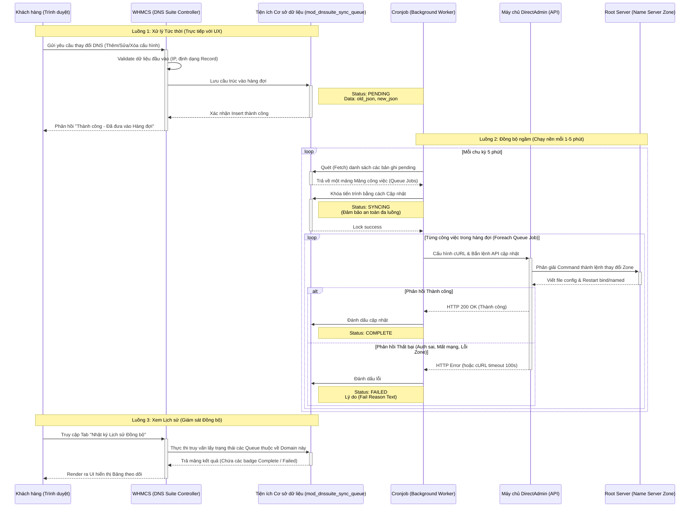

# Sơ đồ Luồng Hoạt Động (Architecture Flow)

Tài liệu này mô tả chi tiết luồng dữ liệu (Data Flow) và trình tự thời gian (Sequence) của hệ thống **Asynchronous DNS Queue** cho WHMCS DNS Suite.

Mô hình này chuyển đổi cấu trúc đồng bộ (chờ phản hồi trực tiếp) thành bất đồng bộ (giải phóng trình duyệt ngay lập tức và xử lý nền).

## Biểu đồ Sequence (Trình tự)

## Chú giải (Legend)

*   **Luồng 1 (Xử lý Tức thời)**: Điểm nghẽn ở hệ thống cũ nằm ở chỗ máy Khách hàng (`C`) phải mở kết nối thẳng đến `DA`. Với lược đồ mới, mọi thứ kết thúc ở Database (`DB`), do đó, độ trễ web chỉ tính bằng **< 10ms**.
*   **Luồng 2 (Đồng bộ Ngầm)**: Cronjob hoạt động độc lập với tương tác của người dùng. Trạng thái `SYNCING` được đưa vào để ngăn chặn hiện tượng hai luồng cronjob chạy gần nhau cùng lấy một lệnh và đẩy lên DA hai lần (Duplicate Data / Race condition).
*   **Root Server**: Bản chất DirectAdmin API sẽ chỉnh sửa file `.db` zone ở thư mục hệ thống (thường nằm tại `/var/named/testdomain.com.db`) và reload lại dịch vụ `named`/`bind`, tức thì phản ánh thay đổi cấu hình hạ tầng mạng trên Internet thực tế.
